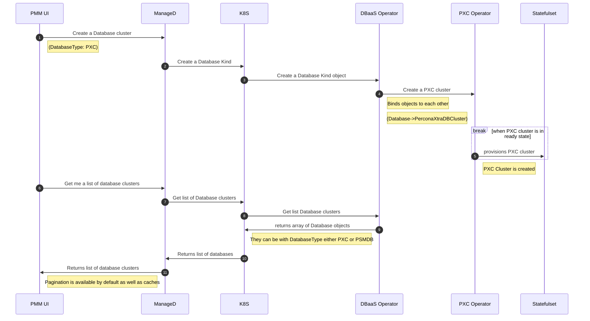

## Getting Started
You’ll need a Kubernetes cluster to run against. You can use KIND to get a local cluster for testing, or run against a remote cluster. Note: Controller will automatically use the current context in your kubeconfig file (i.e. whatever cluster kubectl cluster-info shows).

## Architecture 

DBaaS operator provides an unified CR definition to create the following database cluster

1. Percona Server for MongoDB
2. Percona XtraDB Cluster
3. Postgres (Coming soon)
4. Percona Server (Coming soon)

DBaaS operator relies on upstream operator to create a database cluster and once a user wants to create PXC clusters the following steps should be done

1. PXC operator is installed and running
2. DBaaS operator is installed and running

This operator was implemented during the arhitectural changes for PMM/DBaaS and the diagram below shows how to works with PMM



## Setting up development environment


### Prerequisites
One needs to have the following dependencies installed on the local environment

1. Go 
2. Kind
3. Docker
4. Make

### Running operator outside of a cluster

```
make install run
```

### Installing CRDs

``` 
make install
```

### Using the operator

1. Install Instances of Custom Resources:

```sh
kubectl apply -f config/samples/
```

<!---
2. Build and push your image to the location specified by `IMG`:
	
```sh
make docker-build docker-push IMG=<some-registry>/dbaas-operator:tag
```
	
3. Deploy the controller to the cluster with the image specified by `IMG`:

```sh
make deploy IMG=<some-registry>/dbaas-operator:tag
```
-->

### Uninstall CRDs
To delete the CRDs from the cluster:

```sh
make uninstall
```


### Test It Out
1. Install the CRDs into the cluster:

```sh
make install
```

2. Run your controller (this will run in the foreground, so switch to a new terminal if you want to leave it running):

```sh
make run
```

**NOTE:** You can also run this in one step by running: `make install run`

### Modifying the API definitions
If you are editing the API definitions, generate the manifests such as CRs or CRDs using:

```sh
make manifests
```

**NOTE:** Run `make --help` for more information on all potential `make` targets

More information can be found via the [Kubebuilder Documentation](https://book.kubebuilder.io/introduction.html)

## Testing

We use kuttl and envtests as well as unit tests for local development

1. Kuttl tests can be found in `e2e-tests` directory
2. Other tests can be found in `*_test.go` files

## Submitting a Pull Request

See [Git Workflow](docs/process/git-workflow.md).

As a PR created you are responsible to:
* make sure PR is ready (linted, tested and etc)
* make sure it is reviewed (ask for review, ping reviewers and etc)
* make sure it is merged
  * merge when it is reviewed and tested
  * ask code owners/admins to merge it if merging is blocked for some reason

## After your Pull Request is merged

Once your pull request is merged, you are an official Percona Community Contributor. Welcome to the community!

We're looking forward to your contributions and hope to hear from you soon on our [Forums](https://forums.percona.com).
