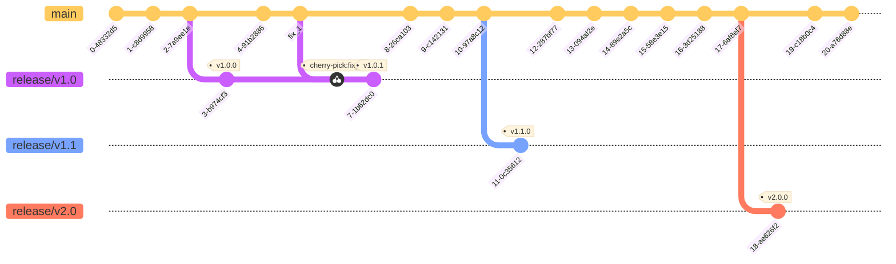

# Git Workflow

All development happens in the `main` branch, and all PRs should be submitted to the `main` branch.

Releases follow [SemVer](https://semver.org/) and start from the `main` branch as `release/vX.Y` branches (with the prefix `v` to distinguish between versions and version system tracking). Releases contain only merged or cherry-picked commits from the `main` branch. 

Release branches are tagged with `vX.Y.Z` tags, and they also could be tagged with `vX.Y.X-rcN` for testing purposes.

## Images

Commits pushed to the `release/vX.Y` branch and tags with `rc` in their names would initiate build and push to the `docker.io/peconalab` registry.

Pushing new tag `vX.Y.X` would initiate build and push to the `docker.io/pecona` registry.

Please check also [Build and Push images](../../.github/workflows/build-push-images.yaml).
