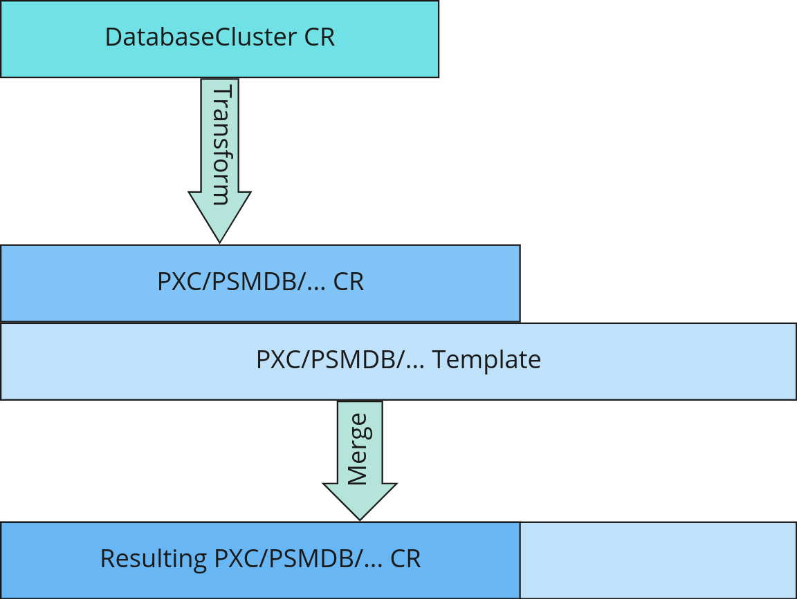

# DatabaseCluster Templates
<!-- toc -->
- [Release Signoff Checklist](#release-signoff-checklist)
- [Open Questions](#open-questions)
- [Summary](#summary)
- [Motivation](#motivation)
  - [Goals](#goals)
  - [Non-Goals](#non-goals)
- [Proposal](#proposal)
  - [User Stories](#user-stories)
    - [Story 1](#story-1)
    - [Story 2](#story-2)
  - [Risks and Mitigations](#risks-and-mitigations)
- [Design Details](#design-details)
  - [DatabaseCluster Template](#databasecluster-template)
  - [Annotations](#annotations)
  - [Labels](#labels)
    - [DatabaseCluster Template implementation](#databasecluster-template-implementation)
  - [Test Plan](#test-plan)
- [Implementation History](#implementation-history)
- [Drawbacks](#drawbacks)
- [Alternatives](#alternatives)
<!-- /toc -->

DatabaseCluster Templates is a convention between different providers and `dbaas-operator` as a consumer to assemble customized CR object for the specific Database Engine.

## Release Signoff Checklist

- [ ] Enhancement is `implementable`
- [ ] Design details are appropriately documented from clear requirements
- [ ] Test plan is defined
- [ ] User-facing documentation is created in [docs](/docs/)

## Open Questions

> 1. Should we have additional controller instead?
> 2. There could be a list of templates required, one for each layer (db conf, net, storage. etc). Now it is assumed that someone merges this to one template and pass it in annotations. Should we think about list?

## Summary

DatabaseCluster Template provides the ability to customize Database Clusters that different operators would deploy according to the use case, environment, or infrastructure used.

Use Case could be a database cluster with different load patterns: simple reads, heavy writes, 50/50% read/write, number of connections, etc.

Infrastructure also requires different parameters and tunings for the resulting cluster, such as network configuration (load balancing, exposure), storage classes/types, etc.

Environments could combine both categories and affect the configuration of the resulting Database Cluster.

## Motivation

Provide the ability for different users to configure needed parameters that would affect the configuration of the deployed Database Cluster.

### Goals

Define consumer convention (format, procedure) for `dbaas-operator` to get the template and create DatabaseCluster CR adjusted by its parameters.

Provide implementation in `dbaas-controller` to find, get, merge template and provide expected DatabaseCluster with correct parameters.

### Non-Goals

The new controller for the Template object is out of the scope of this proposal. As it is still being determined what the end requirements would be, we don't want to produce new API so far to track and update CRs that were based on Templates.

Schema validation for provided Template objects wouldn't be implemented and tracked. 

Application and services that CRUD Template objects.

## Proposal

Percona Kubernetes operators control full CRs that include infrastructural and database configurations:

- configs, sizing, backup parameters, cluster parameters (sharding, replsets)
- toleration, affinity, annotations, storage classes, networking

Different personas would like to control various parts of that complete CR. Some would like more control over DBs and DB Clusters (versions, sizing, backups, configs, parameters). In contrast, others would like to control Kubernetes and Cloud infrastructure (networking, storage, secrets) and how that infrastructure is connected to applications (affinity, networking, RBAC).

All those parts are a subset of Kubernetes CR objects supported by operators and Kubernetes add-ons (such as special annotations) and could be defined as templates.

To define similar properties for different environments, clusters, and namespaces - templates could also have different visibility:

- namespace
- environment
- cluster
- set of clusters

And visibility defines where those could be stored:

- template for a namespace (prod/staging namespaces): as an object in a namespace
- environment templates: template with environment labels to select from
- cluster wide templates: as an object in a cluster for all namespaces
- global templates: in external storage in CI/CD, in PMM as an app that manages many clusters, special service for general database parameters

This proposal introduces DatabaseCluster Template that should be deployed in a namespace for targeted DB Cluster.

### User Stories
#### Story 1

As a DBA I would like to template Cluster and DB parameters for several different environments.
#### Story 2

As an SRE I would like to template Kubernetes specific and cloud infrastructural parameters.

### Risks and Mitigations

There is no controller for the DatabaseCluster Templates; thus, the responsibility to lifecycle them is offloaded to the external party. If proper cleanup and management are not created, there might be a lot of zombie CRs and CRDs in a cluster.

## Design Details

### DatabaseCluster Template

`dbaas-operator` would provide a simplifier interface to abstract the internal mechanics of Kubernetes and different clouds. Hence, templates for its interface are more related to Developer's and DBA's use case. And that makes `dbaas-operator` a more straightforward interface that is just a subset of a full CR template.

As these types of templates are high-level, they would take priority over more low-level templates and could be defined later when business logic on operating templates would be known.



The proposal at the current stage is to use a full CR template (DatabaseCluster Template) defined by SRE/DBA in a namespace that `database-operator` merges with values provided in DatabaseCluster CR in priority:

1. DatabaseCluster CR
2. DatabaseCluster Template

### Annotations

Annotations that the user should set for the DatabaseCluster CR for `dbaas-operator` that are related to the templates:
- `dbaas.percona.com/dbtemplate-kind: PSMDBtemplate`: is CustomResource (CR) Kind that implements template
- `dbaas.percona.com/dbtemplate-name: prod-app-X-small`: `metadata.name` identifier for CR that provides the template.

If one of those two parameters (kind, name) is not set - `dbaas-operator` wouldn't be able to identify the template and thus would ignore it.

`dbaas-operator` merges all annotations from the DatabaseCluster CR, DatabaseCluster Template.

There could be optional annotations (both in DatabaseCluster CR and DatabaseCluster Template) that are used by SRE and/or specific applications that manage templates, such as:

- `dbaas.percona.com/dbtemplate-origin: pmm`: who created the template: pmm, user, sre, dba, ci
- `dbaas.percona.com/dbtemplate-type: infra`: type of the template: infra, db-conf, net-conf, etc
- `dbaas.percona.com/origin: pmm`: who created CR for `database-operator`: pmm, user, sre, dba, ci
- etc

### Labels

All the labels from the DatabaseCluster Template should be merged to the final DB Cluster CR.

#### DatabaseCluster Template implementation

In the first phase, to simplify template creation, it might be better to restrict templates to simple Kubernetes custom objects without an operator that handles them. The architecture for interacting with the other operators has yet to be defined.

To simplify the implementation of `dbaas-operator` it is better to build templates with the same definitions as the corresponding CR of DB Cluster instances. So `dbaas-operator` would blindly merge the template with user input without validating and knowing the details of template implementation. Thus templates should have precisely the same CRD as CRD for DB clusters. CRD for the template is needed to avoid errors, as Kubernetes would validate templates.

Here are CRDs examples for the DB Clusters:

- PSMDBtemplate: [psmdbtpl.dbaas.percona.com.crd.yaml](psmdbtpl.dbaas.percona.com.crd.yaml)
- PXCtemplate: [pxctpl.dbaas.percona.com.crd.yaml](pxctpl.dbaas.percona.com.crd.yaml)

Example of CRs for templates:

- [psmdbtpl.dbaas.percona.com.cr.yaml](psmdbtpl.dbaas.percona.com.cr.yaml)
- [pxctpl.dbaas.percona.com.cr.yaml](pxctpl.dbaas.percona.com.cr.yaml)

CRs could have such annotations:

- `dbaas.percona.com/dbtemplate-origin: sre`: who created template: sre, dba and etc
- TBD

CRs could have these labels:

- `IsDefaultTpl: "yes"`: yes, or no
- `dbaas.percona.com/engine: psmdb`: engine type
- `dbaas.percona.com/template: "yes"`: indicates that this is a template
- TBD

There could be more labels to identify env, teams, and defaults for teams. That logic could be defined later in a separate document with versions of apps that could understand such convention.

Here is an example of two templates creation:
```sh
minikube start

kubectl apply -f pxctmpl.dbaas.percona.com.crd.yaml
customresourcedefinition.apiextensions.k8s.io/pxctemplates.dbaas.percona.com created

kubectl apply -f psmdbtpl.dbaas.percona.com.crd.yaml
customresourcedefinition.apiextensions.k8s.io/psmdbtemplates.dbaas.percona.com created

kubectl apply -f pxctpl.dbaas.percona.com.cr.yaml
pxctemplate.dbaas.percona.com/prod-app-n-large created

kubectl apply -f psmdbtpl.dbaas.percona.com.cr.yaml
psmdbtemplate.dbaas.percona.com/dev-app-x created

kubectl get psmdbtpl,pxctpl
NAME                                        ENDPOINT   STATUS   AGE
psmdbtemplate.dbaas.percona.com/dev-app-x                       31s

NAME                                             ENDPOINT   STATUS   PXC   PROXYSQL   HAPROXY   AGE
pxctemplate.dbaas.percona.com/prod-app-n-large

```

User could get templates by selecting specific dbaas resources:
```sh
kubectl api-resources --api-group=dbaas.percona.com
NAME             SHORTNAMES   APIVERSION                   NAMESPACED   KIND
psmdbtemplates   psmdbtpl     dbaas.percona.com/v1alpha1   true         PSMDBtemplate
pxctemplates     pxctpl       dbaas.percona.com/v1alpha1   true         PXCtemplate

kubectl api-resources --api-group=dbaas.percona.com --verbs=list --namespaced -o name | xargs -n 1 kubectl get -l 'dbaas.percona.com/engine in (psmdb,pxc)',dbaas.percona.com/template="yes"
NAME        ENDPOINT   STATUS   AGE
dev-app-x                       7s
NAME               ENDPOINT   STATUS   PXC   PROXYSQL   HAPROXY   AGE
prod-app-n-large                                                  5m24s
```

### Test Plan

**Note:** *Section not required until targeted at a release.*

Consider the following in developing a test plan for this enhancement:

- Will there be acceptance tests, in addition to unit tests?
- How will it be tested in isolation vs with other components?

No need to outline all of the test cases, just the general strategy. Anything that would count as
tricky in the implementation and anything particularly challenging to test should be called out.

All code is expected to have adequate tests (eventually with coverage expectations).

## Implementation History

Major milestones in the life cycle of a proposal should be tracked in `Implementation History`.

## Drawbacks

The idea is to find the best form of an argument why this enhancement should _not_ be implemented.

## Alternatives

Similar to the `Drawbacks` section the `Alternatives` section is used to highlight and record other
possible approaches to delivering the value proposed by an enhancement.
